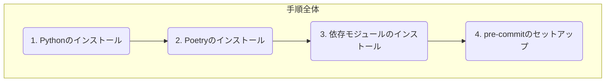

# Contract Master

## 開発環境の構築

このリポジトリを `git clone` した後、以下の手順に従って、初回の開発環境構築を行ってください。



### 1. Pythonのインストール

このリポジトリの開発ではPython3.10を使うため、事前にインストールをしておく。
以下のコマンドで、インストールされているPythonのバージョンを表示して、 `3.10.X` であることを確認する。

```sh
python --version
```

### 2. Poetryのインストール

このリポジトリでは、Pythonのモジュール管理にPoetryを使うため、事前にインストールする。
Poetryのインストールは、以下のコマンドを実行すれば完了する。

```sh
curl -sSL https://install.python-poetry.org | python3 -
```

### 3. 依存モジュールのインストール

以下のコマンドで、Pythonの依存モジュールをインストールする。

```sh
poetry install --sync
```

### 4. pre-commitのセットアップ

このリポジトリでは、コードの品質管理にpre-commitを使っているため、そちらもセットアップする。
pre-commitにはlinterやformatterなどのツールが含まれる。設定は `.pre-commit-config.yaml` を参照。
以下コマンドでセットアップが完了する。

```sh
poetry run pre-commit install
```

## アプリの実行方法

アプリの実行方法について記載。

### 事前設定

#### .envファイルの作成

以下のコマンドで、アプリ実行前に `.env` のファイルを作成して、内容を設定しておく。　　
設定内容は `.env` のファイル内コメントを参考する。

```sh
cp .env.sample .env
```

### 実行コマンド

以下のコマンドでアプリを実行できる。

```sh
poetry run python contract_master/app.py
```
